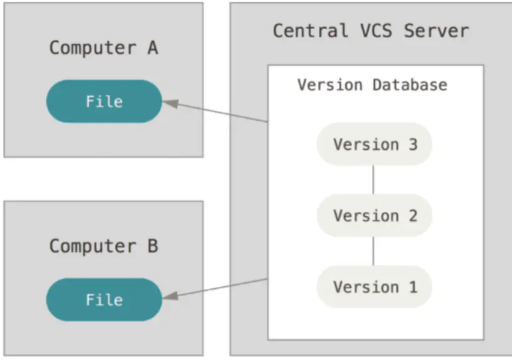
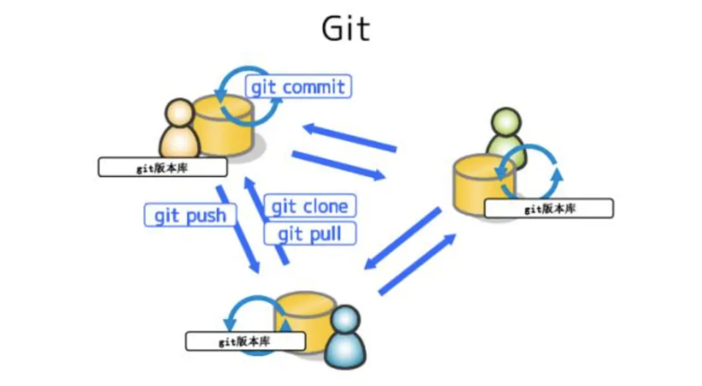
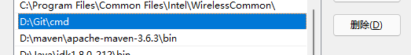
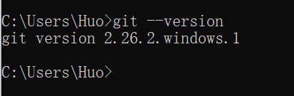
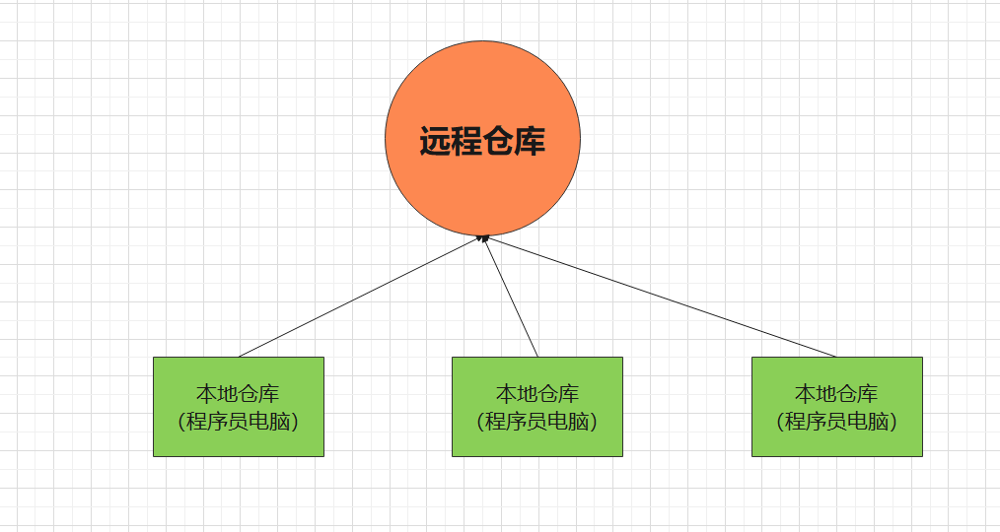
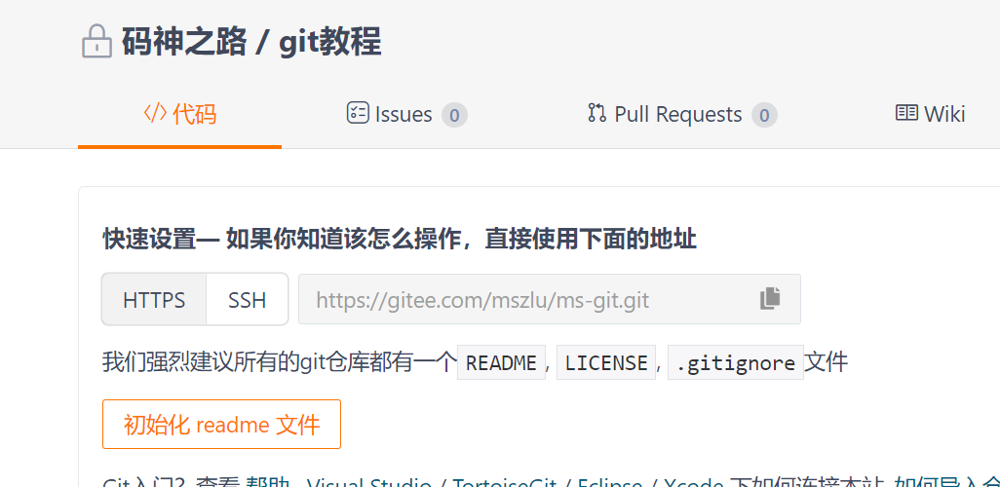
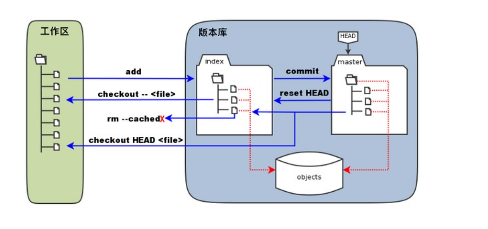

# Git教程

> Git是工作中必不可少的技能，克隆代码，上传代码，合并代码，解决冲突伴随着每天的工作，深入了解并学习Git，能够帮助大家在工作中游刃有余

本教程将从浅到深，逐一讲解，并且使用Git进行实操，让大家知道工作中是如何使用git的。

## 1. 历史

Linus在1991年创建了开源的Linux。

在2002年以前，世界各地的贡献者把源代码文件通过diff的方式发给Linus，然后由Linus本人通过手工方式合并代码。

很明显这是不合适的，在Linux的内核贡献者中，有一名开发者开发了一款VCS（版本控制系统）BitKeeper，是商用软件，但是给Linux社区提供了免费的许可。

Linux社区就用上了BitKeeper。

2005年，社区中有个叫Andrew Tridgell的家伙逆向了BitKeeper，也就是破解了，BitKeeper的拥有者Larry McVoy就取消了对Linux社区的免费许可。

Linus本身对闭源的软件不喜欢，认为软件开源才是天经地义的，同时BitKeeper也不符合他心目中的VCS。

Linus心目中的VCS，不仅要快，还要分布式的，还要开源且安全。

于是：

- 2005年4月3日开始开发
- 2005年4月6日对外公布他正在开发Git
- 2005年4月7日已经实现了使用Git管理Git自己的源码了
- 2005年4月18日已经实现了多个分支合并功能了
- 2005年4月29日将性能提升到了他最初的目标。别忘了，市面上开发了很多年的CVS都无法达到这个性能目标
- 2005年6月16日Linux 内核2.6.12已经用上了Git

Git（C语言实现的） 一经发布就迅速占领了VCS的市场，时至今日，将Git作为主要版本控制系统的公司和个人可以占到90%以上。

在Git的冲击下，BitKeeper的日子也不好过，2016年5月已经开源。

开源软件Git的出现极大的促进人类软件的开发效率，随后的GitHub,GitLab等等基于git的产品更是推升了软件群体的开源奉献意识。

## 2. 分布式版本控制

Git是分布式版本控制系统。

这里，我们讲一个集中式版本控制和分布式版本控制的区别。

典型的两个代表就是svn和git。

基本上现在99%的都在使用svn和git，其中git使用率在90%左右。

**集中式版本控制**

集中式版本控制系统（CVS或者SVN），每个开发者都在他自己的计算机上有一个包含所有项目文件的工作目录（工作区），当该开发者在本地做了更改之后，他就会定期把修改提交给中央服务器。然后，开发者在执行更新操作的同时也会从该服务器上拾取出其他开发者所做的修改，中央服务器上存储着这些文件的当前版本和历史版本。

**分布式版本控制**

分布式版本控制系统（Git），每一个开发者都同时拥有一个用于当前文件操作的工作区与一个用于存储该项目所有版本、分支以及标签的本地版本库。每个开发者的修改都会被载入成一次次的新版本提交，首先提交到本地版本库中。然后，其他开发者就会立即看到新的版本。通过pull和push命令，我们可以将这些修改从一个版本库传送到另一个版本库中。 

> 分布式版本控制系统没有“中央服务器”，每个人的电脑上都是一个完整的版本库，这样工作的时候，无需联网，因为版本库就在你自己的电脑上。多人协作只需要各自的修改推送给对方，就能互相看到对方的修改。
>
> 版本控制的原因：从个人开发过渡到团队协作，不可避免地需要将多人的修改进行合并。

## 3. 安装和配置

官方地址：https://www.git-scm.com/download/ 进行下载。

安装完成后，记得配置环境变量。

cmd验证：

**安装完成后，进行全局配置**

~~~shell
git config --global user.name  "username"  
git config --global user.email  "email"
~~~

> 上述配置是为了标识自己，让其他人知道是谁提交的代码，git规定用名字和邮箱来标识

## 4. 本地仓库和远程仓库

## 5. 创建远程仓库

在gitee上创建远程仓库，用于将本地仓库的代码，提交到远程仓库

## 6. 创建本地仓库

~~~go
mkdir ms-git
cd ms-git
git init 
touch README.md
git add README.md
git commit -m "first commit"
git remote add origin https://gitee.com/mszlu/ms-git.git
git push -u origin "master"
~~~

`git init`：当前目录变成Git可以管理的仓库

`git add`: 把文件添加到本地仓库的暂存区

`git commit`: 把文件提交到本地仓库，注意必须加 -m 后面跟着本次提交的内容说明

`git remote`: 将本地仓库和远程仓库链接起来 origin是远程仓库的名称，git的默认，可以理解为给远程仓库起了个别名

`git push`：将本地仓库的内容变更 提交到远程仓库  origin就代表远程仓库，master代表分支 ,第一次提交需要加上`-u`参数，git会将本地仓库的master分支和远程仓库的master分支做一个关联

`git status`：查看状态

清除密码：

~~~shell
git config --system --unset credential.helper
~~~

~~~shell
git credential-manager uninstall
~~~

重新设置要存储账号密码：

~~~shell
git config --global credential.helper=store
~~~

## 7. 工作区与暂存区

我们先来理解下 Git 工作区、暂存区和版本库概念：

- **工作区：**就是你在电脑里能看到的目录。
- **暂存区：**英文叫 stage 或 index。一般存放在 **.git** 目录下的 index 文件（.git/index）中，所以我们把暂存区有时也叫作索引（index）。
- **版本库：**工作区有一个隐藏目录 **.git**，这个不算工作区，而是 Git 的版本库。

下面这个图展示了工作区、版本库中的暂存区和版本库之间的关系：

- 图中左侧为工作区，右侧为版本库。在版本库中标记为 "index" 的区域是暂存区（stage/index），标记为 "master" 的是 master 分支所代表的目录树。
- 图中我们可以看出此时 "HEAD" 实际是指向 master 分支的一个"游标"。所以图示的命令中出现 HEAD 的地方可以用 master 来替换。
- 图中的 objects 标识的区域为 Git 的对象库，实际位于 ".git/objects" 目录下，里面包含了创建的各种对象及内容。
- 当对工作区修改（或新增）的文件执行 **git add** 命令时，暂存区的目录树被更新，同时工作区修改（或新增）的文件内容被写入到对象库中的一个新的对象中，而该对象的ID被记录在暂存区的文件索引中。
- 当执行提交操作（git commit）时，暂存区的目录树写到版本库（对象库）中，master 分支会做相应的更新。即 master 指向的目录树就是提交时暂存区的目录树。

## 8. 版本回退

`git log`：查看历史记录

`git reset`：git reset 命令用于回退版本，可以指定退回某一次提交的版本

reset 有三个参数：

1. **--mixed**

   默认，可以不用带该参数，用于重置暂存区的文件与指定的回退的版本的提交(commit)保持一致，工作区文件内容保持不变。

   示例：

   ~~~shell
   git reset HEAD^
   ~~~

2. **--soft**

   参数用于回退到某个版本，暂存区不会重置，工作区也不会改，版本回退（git log 版本截止到回退的版本）

   示例：

   ~~~shell
   git reset --soft HEAD~3
   ~~~

   

3. **--hard** 

   参数撤销工作区中所有未提交的修改内容，将暂存区与工作区都回到指定的回退版本，并删除之前的所有信息提交

   示例：

   ~~~shell
   git reset --hard origin/master    # 将本地的状态回退到和远程的一样 
   ~~~

   **注意：**谨慎使用 --hard 参数，它会删除回退点之前的所有信息，一定要在使用--hard之前 先把本地的代码提交到远程仓库

**HEAD 说明：**

- HEAD 表示当前版本
- HEAD^ 上一个版本
- HEAD^^ 上上一个版本
- HEAD^^^ 上上上一个版本
- 以此类推...

可以使用 ～数字表示

- HEAD~0 表示当前版本
- HEAD~1 上一个版本
- HEAD^2 上上一个版本
- HEAD^3 上上上一个版本
- 以此类推...

## 9. 回到未来版本

`git reflog` ：引用日志（以往操作的所有日志）

只要你commit到本地仓库的代码，即使reset之后，也可以通过reflog找到对应的版本号，进行恢复

## 10. 分支

`git branch`: 分支操作命令

`git branch 分支名称`: 创建新分支 (默认从当前的分支进行创建)

`git branch 新分支名称 已有分支名称` : 从已有的分支copy创建一个新的分支 

`git checkout 分支名称` ： 切换到对应的分支

`git branch -d 分支名称`：删除分支（当前所在的分支 不能删除）

真实环境创建分支的规则：

1. 分支分为 master分支，dev分支，test分支
2. master不能随便进行代码提交，上线的版本分支要从master分
3. 上线1.0版本了 从master分支创建一个新的分支1.0分支（当前的线上版本）
4. 一旦线上出现bug，需要切换到1.0版本进行bug修正，进行上线，同时将bug修正的代码合并到master分支
5. dev开发分支，我们不要直接在dev开发分支上进行开发
6. 去了公司之后，第一件事 就是建立自己的分支（从dev分支创建），分支名称可以改为自己的名字
7. 开发是在自己的分支上进行开发，开发完成之后，自测没有问题，将分支的代码合并到dev分支，完成了开发任务
8. 分支合并，多人进行开发，团队协作，提交代码的时候，如何提交？
   1. 先将本地代码进行提交到 自己的分支上
   2. 切换到dev分支，拉取最新的代码
   3. 然后切换到自己的分支，然后将dev分支代码合并到自己的分支上（解决冲突），提交合并代码
   4. 然后切换到dev分支，将自己分支合并完的代码合并到dev分支

## 11. 合并

`git merge`: 合并分支代码

dev分支的代码要合并到master分支上

步骤：

1. 先将dev分支的代码进行commit
2. 切换到要合并的分支上 master
3. git merge dev 将dev分支的代码合并到master分支
4. 可能会遇到代码冲突，解决冲突，然后在提交
5. 代码要以master为主（有冲突 解决冲突了）
6. 切换到dev分支，合并master分支到此分支
7. 也就是说 现在master分支和dev分支保持一致了
8. 合并完成

冲突说明：

~~~shell
<<<<<<< HEAD
 这块代码是当前版本的代码
=======
~~~

~~~shell
=======
这块代码是dev分支的代码
>>>>>>> dev
~~~

解决冲突就是在两个版本之间 选择采用哪个版本

### 11.1 远程仓库合并

开发完成之后想要提交远程仓库：

1. 先提交到本地仓库
2. 在提交远程仓库的时候，要注意，不确定远程仓库是否有新的代码，需要先进行代码的拉取操作
   1. git pull
   2. 在拉取的时候 git会自动进行代码的合并
   3. 如果有冲突 就会提示有冲突 需要解决冲突
3. 冲突解决完之后，进行本地仓库的提交 git commit
4. 然后git pull 确保没有新的代码产生，然后进行git push

> 合并代码 git rebase 合并代码，但是这个方式 一般不推荐使用

## 12. 克隆

`git clone 远程仓库地址`： 从远程仓库拉取最新的代码到本地

## 13. 使用Idea操作git

### 13.1 gitignore

`.gitignore` :  忽略不需要提交的文件

~~~ini
.idea
target
*.iml
.project
~~~

### 13.2 idea解决冲突

绿色：无脑点箭头 （Accept）

红色（冲突） ：当前的版本和远程仓库版本之间选择一个 ，另一个忽略即可（选一个箭头Accept，另一个x Ignore）

蓝色：无脑点箭头 （Accept）

## 14. SourceTree

## 15. stash

`git stash list`:查看

`git stash apply`： 恢复

`git stash drop`: 删除

`git stash pop` ：恢复并删除

比如 dev分支 正在进行开发，测试人员在dev分支上发现了一个bug，需要去解决bug，但是开发到一半的代码并不能进行提交。

先把当前的代码 进行隐藏，先去解决bug，解决完bug ，恢复现场。

## 16. revert 回滚

> 会生成一个新的版本

1、找到你误提交之前的版本号

2、git revert -n 版本号

3、git commit -m xxxx 提交

4、git push 推送到远程

回滚 ： 只回滚 要回滚的版本的当时修改的代码状态，其他的并不会回滚 也不会删除

## 17. gitlab

> 自建git服务器

2222222222222222